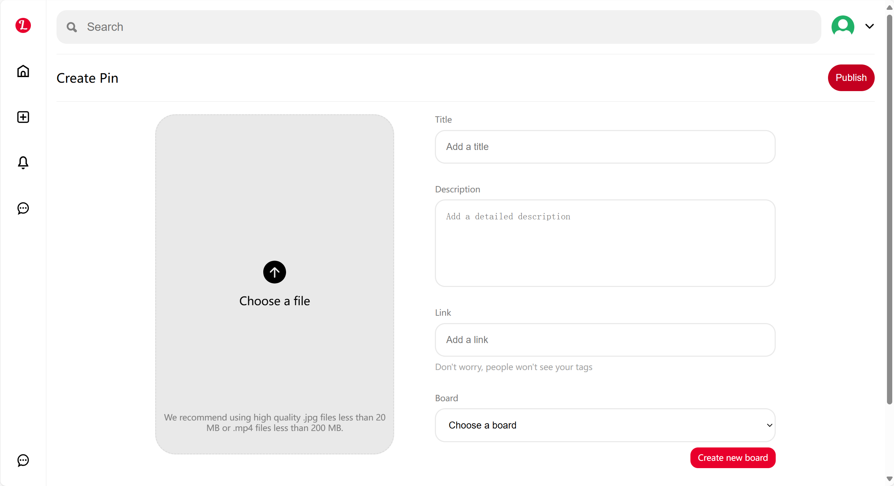
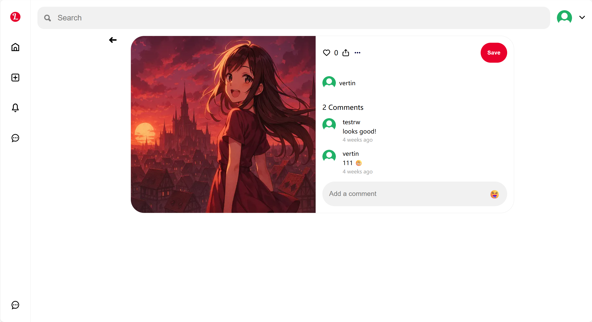
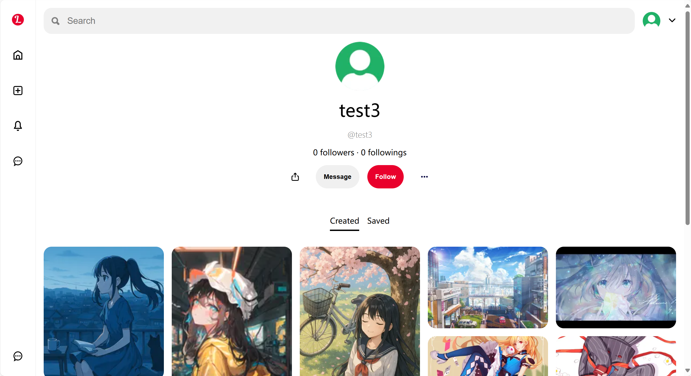

# 📌 全栈仿 Pinterest 图钉墙应用

一个使用 React、Node.js、Express 和 MongoDB 构建的全栈 Pinterest 克隆应用。用户可以注册、登录、上传图片（称为“Pin”）、查看动态流，并管理自己的 Pin 板。

## 🧰 技术栈

| 层级   | 使用的技术                                |
| ------ | ----------------------------------------- |
| 前端   | React、React Router、Zustand、React Query |
| 后端   | Node.js、Express                          |
| 数据库 | MongoDB、Mongoose ODM                     |
| 认证   | JWT（JSON Web Token）                     |

## ✨ 功能

- 🧾 用户注册与登录
- 🔒 基于 JWT 的认证
- 📤 图片上传（Pin）
- 🧭 浏览所有 Pin 的动态流
- 📌 每个用户的个人 Pin 板页面
- ❤️ 收藏和关注功能

## 🖼️ 截图

- 主页展示
  
- 上传界面
  
- Pin 展示
  
- 用户个人主页
  

## 📁 项目结构

```
full-stack-pinterests/
├── frontend/
│   ├── src/
│   └── public/
├── backend/
│   ├── routes/
│   ├── models/
│   ├── middleware/
│   └── controllers/
```

## 📚 学习成果

- 使用图片数据实现全栈 CRUD 操作
- RESTful API 的设计与集成
- JWT 认证与受保护路由
- 使用 Multer 处理文件上传
- 使用 React 和 Axios 实现动态渲染的前端

## 🙋 联系

由 @vertin5015 创建 - 欢迎联系！
